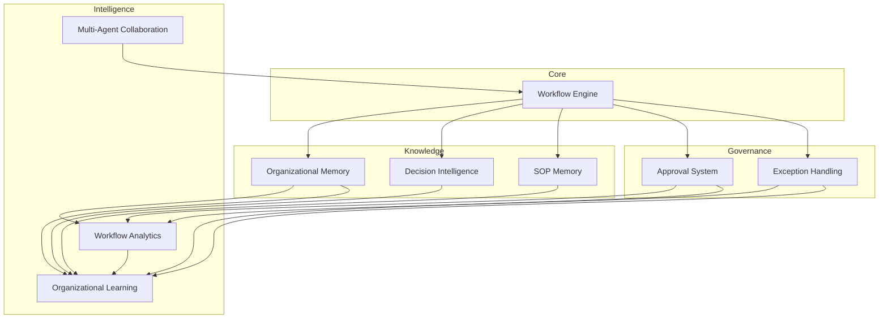
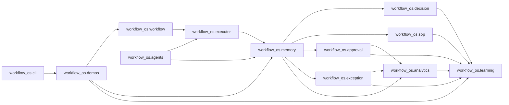
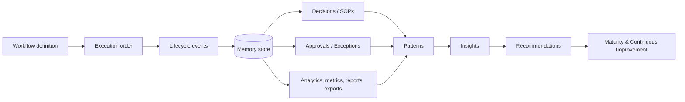

# Architecture

The workflow operating system is a layered, deterministic library. Each layer is
an additive subpackage that consumes the outputs of the layers beneath it; there
is no machine learning, prediction, or external service anywhere in the stack.

Diagram sources live in [`assets/architecture/`](../assets/architecture/) as
Mermaid (`.mmd`) files and are embedded below.

## System architecture

The core workflow engine feeds a knowledge layer (memory, decisions, SOPs), a
governance layer (approvals, exceptions), and an intelligence layer (analytics,
organizational learning). Multi-agent collaboration coordinates execution on top
of the engine.

## Module relationships

How the Python subpackages depend on each other. Dependencies only point
"downward" toward more fundamental modules, keeping the layering clean.

## Data flow

A workflow definition becomes an execution order, which produces lifecycle events
recorded in the memory store. Those events fan out to decisions, SOPs, approvals,
exceptions, and analytics, and finally converge in the learning layer as
patterns, insights, recommendations, and a maturity score.

## Design principles

- **Deterministic and rule-based.** Same input, same output, every time.
- **Additive layering.** New phases add subpackages without modifying existing
  ones, preserving backward compatibility.
- **Plain data + small functions.** Schemas are dataclasses; behavior lives in
  focused, well-tested functions.
- **Storage behind protocols.** Stores share a common interface with in-memory
  and SQLite implementations.
